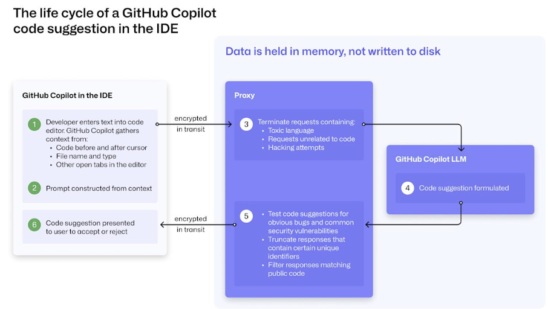

# Github 조사 리포트
### 팀원
- 컴퓨터학부/2022111805/배준호/BaeJunH0
- 컴퓨터학부/2014097035/박성원/tt0410tt
- 컴퓨터학부/2023013074/배규민/GyuminBae
- 컴퓨터학부/2021112698/박도윤/bagdodo8
- 전자공학부/2021110253/차민성/miinscar

## 개요
**Github**는 Git Repository Hosting을 지원하는 Ruby On Rails로 작성된 Web Service이다.

현재 가장 인기 있는 Git Repository Hosting Service이고, 영리적 서비스와 오픈소스를 위한 비영리적 무상 서비스를 모두 제공한다.

`코드 백업` 및 `버전 관리`, `협업`, `오픈소스 기여`, `포트폴리오로 활용`, `테스트, 배포 자동화` 등 개발자에게 필요한 다양한 기능을 제공하여 현재 [약 1억 5천만명의 개발자들이 이용하는 중](https://github.blog/news-insights/product-news/github-copilot-in-vscode-free/)이다.  

## 라이선스
**Github** 는 기본적으로 무료 사용 가능하지만, 오픈소스는 아니며 `Microsoft가 소유한 플랫폼`이다.  

| 요금제 | 가격 (월/인당) | 주요 대상 | 주요 기능 |
| --- | --- | --- | --- |
| **Free** | 무료 | 개인 사용자, 간단한 프로젝트 | - 무제한 공개/비공개 레포<br>- 커뮤니티 지원<br>- 기본 CI/CD (GitHub Actions) |
| **Pro** | $4/월 | 개인 개발자 | - Free 플랜 +<br>- 고급 Insights (리포지토리 분석)<br>- GitHub Codespaces 사용량 증가 |
| **Team** | $4/월/사용자 | 소규모 팀 | - Pro 플랜 +<br>- 팀 권한 설정 (role management)<br>- 코드 소유자(Code owners)<br>- 보안 정책 강화 |
| **Enterprise** | $21/월/사용자 | 기업 고객 | - Team 플랜 +<br>- SAML/SSO<br>- 감사 로그<br>- 고급 보안 스캐닝 (Advanced Security)<br>- Enterprise Managed Users (EMU) |

## 주요 기능
### 1. VCS
GitHub의 핵심 기능 중 하나인 VCS(Version Control System, 버전 관리 시스템)는 소스 코드의 변경 이력을 체계적으로 관리하고, 팀원 간의 협업을 원활하게 만들어주는 기능이다. GitHub는 Git을 기반으로 한 분산형 VCS를 활용하여 사용자들이 로컬에서 작업한 내용을 온라인 상의 원격 저장소(Remote Ropesitory)와 동기화하고 관리할 수 있게 한다.

**commit**
commit은 변경 사항을 저장하는 단위이다. 개발자가 코드를 수정하고 이를 GitHub에 반영하기 위해서는 변경된 파일을 스테이지에 올린 후 commit을 수행한다. 이 commit에는 언제, 누가, 어떤 내용을 수정했는지에 대한 정보가 포함되며, 이러한 commit들은 시간순으로 기록되어 전체 프로젝트의 변경 이력을 추적할 수 있게 해준다.


**VCS 예시**
```yaml
1. git clone https://github.com/사용자/프로젝트
2. git checkout -b 새로운기능브랜치
3. 코드 수정
4. git add .
5. git commit -m "feat: 새로운 기능 추가"
6. git push origin 새로운기능브랜치
7. GitHub에서 Pull Request 생성
8. 리뷰 후 merge
```

**정리**
GitHub의 VCS는 개발자가 소스코드를 안전하게 저장하고, 효율적으로 협업하며, 프로젝트의 전체 변경 이력을 명확히 추적할 수 있도록 해준다. 브랜치, 커밋, 풀 리퀘스트, 히스토리 추적 등의 VCS 기능들이 GitHub를 세계에서 가장 널리 사용되는 개발 플랫폼으로 만들었다고 볼 수 있다.

### 2. Issue Management
GitHub의 Issue Management 기능은 프로젝트 관리와 협업을 원활하게 해주기 위한 기능이다.  
개발 중인 프로젝트의 새로운 기능을 제안하거나, 버그를 신고하는 등의 목적으로 사용되며. 이 때, 작업 단위로 개발 내용을 설명하고, 우선 순위를 정하고, 담당자를 지정하여 프로젝트의 개발 과정을 체계적으로 관리할 수 있다.

**Issue 작성**

Issue 자체는 제목과 본문으로 작성되며, MarkDown 문법을 지원하여 readme.md와 같은 md 확장자 파일과 동일한 방식으로 유저 친화적으로 내용을 작성할 수 있다.  
Issue 제목과 본문 작성 이외에도 해당 작업을 누가 처리할지 담당자를 지정할 수 있고, 이슈의 성격에 따라  `bug`, `feature`, `question`, `refactor`, `chore` 같은 Label을 통해 Issue의 종류를 한눈에 파악할 수 있다.  
또한, Label의 경우 Github Repository 생성시 자동으로 생성되지만, 이를 삭제, 수정, 추가하여 Issue 및 Pull Request에 사용할 Label을 자유롭게 커스터마이징하여 사용할 수 있다.  

**Issue Template**

자주 사용하는 `버그 리포트`, `새로운 기능 제안`과 같은 Issue 유형에 대해 Issue Template를 만들어두면, Issue 작성 시 일관된 형식으로 작성하고 정보를 받을 수 있어 개발 생산성이 향상된다.  
Issue Template은 .github/ISSUE_TEMPLATE 디렉토리에 위치하며, template_name.md 파일 형식으로 작성된다.

**Issue Template 작성 예시**

```yaml
issueTemplate1.md
---
name: 새로운 기능 제안
about: 기능 제안 이슈 생성
title: ''
labels: ''
assignees: ''
---

## 이슈의 제목

### 구현할 사항 

### 구현 이유

### 레퍼런스
```

**Issue와 Milestone**

Github에서는 여러 개의 비슷한 속성을 가진 Issue를 하나의 목표로 묶기 위해 Milestone 기능을 사용할 수 있다.  
예를 들어 `v1.0 Launching`라는 Milestone에 관련 Issue들을 모아두면, 버전 단위로 Issue를 관리하는 방식이 되어 얼마나 작업이 진행되었는지 시각적으로 확인할 수 있어 유용하다.  
또한, 프로젝트 보드 기능과 연동하면 칸반 보드 형태로 Issue들을 `Todo`, `In Progress`, `Done` 등의 상태로 이동시키며 관리할 수 있어 협업 시 매우 직관적으로 개발 과정을 파악할 수 있다.  

**Issue 보드 예시**


**Issue와 Pull Request ( PR )**

Issue는 `Pull Request`와도 긴밀하게 연결되어 있다.  
우선, Issue와 Pull Request는 자동 생성되는 Issue 번호를 공유한다. 예를 들어 `Issue #4` 이후 Pull Request를 생성하면 해당 Pull Reqeust의 Issue 넘버링은 `#5`가 된다.  
또한, Issue의 생명 주기는 Pull Request의 Merge와 깊은 연관이 있다. 예를 들어 Pull Request 제목을 `Fix : #12~`처럼 작성하면 해당 Pull Request이 Merge되었을 때 자동으로 `Issue #12`가 닫히게 된다.   
보통 이런 방식으로 하나의 Issue를 담당하는 하나의 PR이 매칭되는 방식으로 Contributing이 진행된다.  
또한, Pull Request의 가장 큰 이점 중 하나는 코드 리뷰와 댓글을 통한 커뮤니케이션에 있다고 할 수 있는데, Issue에도 Pull Request와 같이 자유롭게 댓글을 달 수 있고, 팀원들과 논의하며 작업 방향을 결정할 수 있어 Issue 역시 커뮤니케이션 도구로도 사용될 수 있다.  

**정리**

이처럼 GitHub의 `Issue Management`는 새로운 기능이나 버그에 대한 안내 이외에도, 팀의 협업과 일정 관리를 돕는 강력한 도구로 활용할 수 있다.  

### 3. Actions
GitHub Actions는 GitHub에서 제공하는 CI/CD(지속적 통합 및 지속적 배포) 도구로, 리포지토리의 이벤트를 트리거로 하여 자동화된 워크플로우를 실행할 수 있게 해준다.  
코드가 특정 브랜치에 push 되었을 때 빌드 및 배포를 자동화하거나, PR이 생성되었을 때 테스트를 실행하고 리포트를 코멘트로 올리는 등의 작업을 할 수 있다. 

Actions 스크립트에는 총 6가지의 핵심 구성 요소가 존재한다.
- **Workflow** : 하나 이상의 Job으로 구성된 자동화 프로세스. `.github/workflows` 디렉토리에 `.yml` 파일로 정의한다.
- **Event** : 워크플로 실행을 트리거하는 리포지토리의 특정 행동을 의미한다.
- **Job** : 여러 Step으로 구성되며, 각각 독립적인 가상 환경(또는 컨테이너)에서 실행된다.
- **Step** : 명령어 실행 또는 Action 호출 단위.
- **Action** : 재사용 가능한 코드 조각. 공식 마켓플레이스 또는 커스텀으로 작성하여 사용할 수 있다.
- **Runner** : Job이 실제 실행되는 환경. GitHub에서 제공하는 Hosted Runner를 쓰거나, Self-hosted Runner를 직접 설치할 수도 있다.
  
워크플로우는 기본적으로 `workflow → jobs → steps` 구조로 구성된다. 
하나의 워크플로우는 여러 개의 작업(job)을 포함할 수 있고, 각 job은 독립적인 실행 단위로서 서로 다른 러너에서 병렬로 수행될 수 있다. 
각 job 내부에는 step이 있으며, 이는 실제로 실행되는 명령어나 액션들로 구성된다. 이러한 구조를 통해 복잡한 파이프라인도 논리적으로 구성할 수 있다. 

Actions에서는 반복적인 워크플로우 정의를 줄이기 위해 워크플로우를 재사용할 수 있다.  
중복되는 빌드/배포 로직을 별도의 `.yml` 파일로 분리하여, 여러 리포지토리나 워크플로우에서 호출할 수 있도록 해준다.  
이를 통해 유지보수성이 향상되고, 대규모 프로젝트나 조직 내 일관된 CI/CD 정책을 사용할 수 있다. 

**Actions CI/CD 스크립트 작성 예시**
```yaml
name: CI Pipeline

on:
  push:
    branches: [ "main" ]
  pull_request:
    branches: [ "main" ]

jobs:
  build:
    runs-on: ubuntu-latest

    steps:
    - name: Checkout Repository
      uses: actions/checkout@v3

    - name: Setup Node.js
      uses: actions/setup-node@v3
      with:
        node-version: '18'

    - name: Install Dependencies
      run: npm install

    - name: Run Tests
      run: npm test
```

이 예시는 `main` 브랜치에 코드가 push 되거나 PR이 생성되었을 때 `build`라는 Job이 실행되며, 프로젝트의 소스코드를 checkout하고 Node.js와 npm을 셋업한 뒤, 테스트를 실행한다.

**Actions의 장점** 

GitHub Actions의 가장 큰 장점 중 하나는 GitHub와의 깊은 통합이다. GitHub의 `push`, `pull request`, `issues`, `release` 같은 이벤트를 워크플로우 트리거로 사용할 수 있어, 개발 흐름 안에 자연스럽게 자동화를 녹여낼 수 있다. 
또한 GitHub는 Actions 마켓플레이스를 통해 수천 개의 오픈소스 액션을 제공하고 있어, 복잡한 설정 없이도 다양한 기능을 바로 활용할 수 있다.

실행 환경은 기본적으로 제공되는 호스팅 러너(Github-Hosted Runner) 외에도, 사용자가 온-프레미스 환경에서 직접 관리할수 있는 Self-hosted Runner 를 설정할 수 있다. 
Self-hosted Runner는 특정 하드웨어나 운영체제, 네트워크 조건 등 사용자 맞춤 환경에서 동작할 수 있기 때문에, 고사양 빌드 머신, 내부 시스템과 연동이 필요한 워크플로우 등에 특히 유용하다. 
또한 반복적으로 실행되는 워크플로우에 대해 실행 시간을 단축할 수 있으며, 기업에서는 자체 방화벽 안에서 모든 자동화 작업을 처리할 수 있다는 점에서 보안성도 크게 향상된다. 

GitHub Actions는 Docker 컨테이너 또는 커스텀 스크립트를 실행할 수 있는 유연성을 가지고 있어 복잡한 빌드 및 배포 파이프라인도 쉽게 설정 가능하다. 
보안 측면에서도 GitHub Secrets를 통해 민감한 정보(API 키, 토큰 등)를 안전하게 관리할 수 있으며, 환경 변수와 조합하여 다양한 설정을 할 수 있다. 
또한 워크플로우 내에서 job을 병렬 또는 순차적으로 실행할 수 있고, 조건문(`if`)과 매트릭스 전략(matrix strategy)을 이용하면 다양한 환경에 대한 테스트를 동시에 실행할 수 있어 테스트 커버리지 향상에도 기여한다. 

GitHub Actions는 GitOps 방식에도 널리 활용된다. GitOps는 애플리케이션의 배포 및 운영 환경 설정을 Git 리포지토리로부터 선언적으로 관리하는 접근 방식으로, 
GitHub Actions를 사용하면 코드 변경 사항이 Git에 반영됨과 동시에 자동으로 클러스터에 배포되도록 설정할 수 있다. 
이로써 인프라 변경 사항 역시 코드 리뷰 및 변경 이력의 추적이 가능해지게 된다. 

**Best Practice**
- 워크플로우는 작고 명확하게 구성하도록 한다. Job 단위로 분리해 병렬 처리 효율을 높이는 것이 좋다.
- 민감한 secret key나 api 토큰 등의 값은 직접 코드에 하드코딩하여 노출시키지 않고, `secrets`에 등록하여 사용한다.
- 워크플로우 파일 변경 시에는 별도의 브랜치에서 테스트하고 main에 `merge`하는 것이 안전하다.
- 주기적인 캐시 설정(`actions/cache`)을 통해 빌드 속도를 개선할 수 있다.


### 4. Copilot
GitHub Copilot은 개발자가 코드를 더 빠르고 효율적으로 작성할 수 있도록 돕는 인공지능 기반 코딩 보조 도구다. GitHub와 OpenAI가 공동 개발하였으며, OpenAI의 GPT 계열 언어 모델을 기반으로 한다. 사용자가 작성 중인 코드와 주석, 함수 이름 등 문맥을 실시간으로 분석하여, 이어서 작성할 가능성이 높은 코드를 자동으로 제안하는 것이 주요 기능이다. 단순한 자동 완성을 넘어서, 마치 옆에서 함께 코딩하는 ‘AI 파트너’처럼 행동하기 때문에 ‘AI 페어 프로그래머’라고 불리기도 한다.

이 도구는 Visual Studio Code, JetBrains IDE, Neovim 등 주요 개발 환경에 플러그인 형태로 설치할 수 있으며, 다양한 언어와 프레임워크를 지원한다. 특히 Python, JavaScript, TypeScript, Java, Go, C++ 등 폭넓은 언어군을 대상으로 자연스럽고 직관적인 코드 추천을 제공한다.



Copilot은 다음과 같은 주요 기능을 한다.
- 문맥 기반 코드 자동완성 : 사용자가 작성 중인 변수명, 함수 이름, 시그니처 등을 바탕으로 문맥을 이해하고 그에 맞는 전체 코드 블록을 자동으로 제안한다. 기존의 단순한 자동완성과 달리 실제로 실행 가능한 코드 수준까지 완성된다.
- 주석 -> 코드 생성 : 개발자가 주석으로 기능을 설명하면 Copilot은 해당 주석을 분석하여 기능을 수행하는 코드를 자동으로 작성한다. 자연어 기반 주석만으로도 원하는 알고리즘이나 로직을 빠르게 구현할 수 있다.
- 반복 작업 자동화 : 조건문, 반복문, 리스트 처리, API 호출 등 자주 반복되는 코딩 작업을 자동으로 생성해주는 기능을 제공한다. 이를 통해 반복 작업에 드는 시간을 줄이고 코드 작성의 효율을 높일 수 있다.
- 다양한 언어 지원 : Python, JavaScript, TypeScript, Java 등 다양한 언어를 지원하며, HTML, CSS와 같은 마크업 언어에도 대응한다. 여러 개발 환경과 언어에 적응할 수 있도록 설계되어 있다.
- 실시간 코드 추천 : 코드를 작성하는 도중에도 자동으로 추천을 제공하므로, 개발자는 키 입력만으로도 필요한 코드를 빠르게 불러올 수 있다. 작성된 코드 흐름을 고려하여 실시간으로 다음 문장을 예측해 제안한다.
- 개발자 스타일 학습 : 사용자가 반복적으로 작성하는 코드 스타일이나 패턴을 인식하여, 점차 사용자의 코딩 습관에 맞춘 추천을 제공한다. 장기적으로 사용할수록 더 정밀한 맞춤형 코드 생성을 기대할 수 있다.

Copilot 실제 사용 예시

실제로 Copilot을 사용할 때 가장 큰 장점은 ‘생각보다 빠르게 작동한다’는 것이다. 예를 들어 Python에서 def fibonacci(n):만 작성하면, Copilot은 즉시 재귀적으로 피보나치 수열을 구하는 함수를 자동으로 완성해준다. JavaScript에서 // remove duplicates from an array라는 주석을 입력하면, [...new Set(array)]같은 간단하고 효율적인 코드가 제안된다.
이러한 기능은 초보 개발자에게는 학습용 코드 예제로, 숙련 개발자에게는 반복 작업 제거 및 코드 스캐폴딩 용도로 특히 유용하다. 프로젝트의 초반 구조를 빠르게 구성하거나, 알고리즘 구현의 초안을 만들고자 할 때도 빠른 도움을 받을 수 있다.

```python
def fibonacci(n):
    if n <= 1:
        return n
    return fibonacci(n-1) + fibonacci(n-2)
```

Copilot의 장점과 한계

GitHub Copilot의 가장 큰 장점은 개발자의 생산성을 크게 향상시킨다는 점이다. 반복적인 코드 작성이나 기본적인 함수 구현, API 호출 등 자주 사용되는 패턴을 자동으로 완성해주기 때문에 개발 속도가 빨라지고, 더 중요한 로직 설계나 문제 해결에 집중할 수 있게 된다. 특히 주석만 입력하면 해당 기능을 수행하는 코드를 자동으로 생성해주는 기능은 초보 개발자에게 매우 유용하며, 자연어로 프로그래밍을 지원하는 새로운 접근 방식으로 평가받고 있다. 또한 Copilot은 Python, JavaScript, Java, C++, Go 등 다양한 언어를 지원하며, 사용자의 코드 스타일을 점차 학습해 더 개인화된 추천을 제공한다. 낯선 라이브러리나 프레임워크를 처음 사용할 때도 예시 코드를 통해 쉽게 접근할 수 있어 학습 도구로서의 역할도 수행한다.

반면 Copilot은 아직까지 완전한 개발 도구로 보기에는 몇 가지 단점이 존재한다. 가장 큰 문제는 생성된 코드의 정확성과 신뢰성이 항상 보장되지 않는다는 점이다. 제안된 코드가 논리적으로 잘못되었거나 실행 시 오류가 발생할 수 있으며, 성능이나 보안 측면에서도 충분히 고려되지 않은 코드가 생성될 수 있다. 특히 보안이 중요한 서비스에서는 입력값 검증이나 인증 처리가 누락된 채 코드가 제안되는 경우가 있어 주의가 필요하다. 또한 Copilot은 오픈소스 코드 기반으로 학습된 모델을 사용하기 때문에, 생성된 코드가 특정 라이선스를 암묵적으로 포함할 가능성이 있으며, 이를 상용 프로젝트에 그대로 사용하는 것은 법적인 문제가 될 수 있다.

정리

GitHub Copilot은 코드 자동 생성 도구 그 이상으로, 개발자의 코딩 방식 자체를 변화시키고 있다. 반복적인 코드를 줄이고, 더 빠른 아이디어 구현을 가능하게 하며, 개발 과정 전반에 걸쳐 효율성을 높인다. 물론 아직은 완전한 자동화보다는 ‘보조’의 역할에 머물고 있지만, 앞으로 AI 기술이 더 발전함에 따라 코딩 작업의 많은 부분을 자연스럽게 분담해줄 수 있을 것으로 기대된다. GitHub Copilot은 단순한 기능의 하나라기보다는, 개발 환경 전체에 영향을 주는 새로운 패러다임의 시작이라고 볼 수 있다.

### 5. Packages

